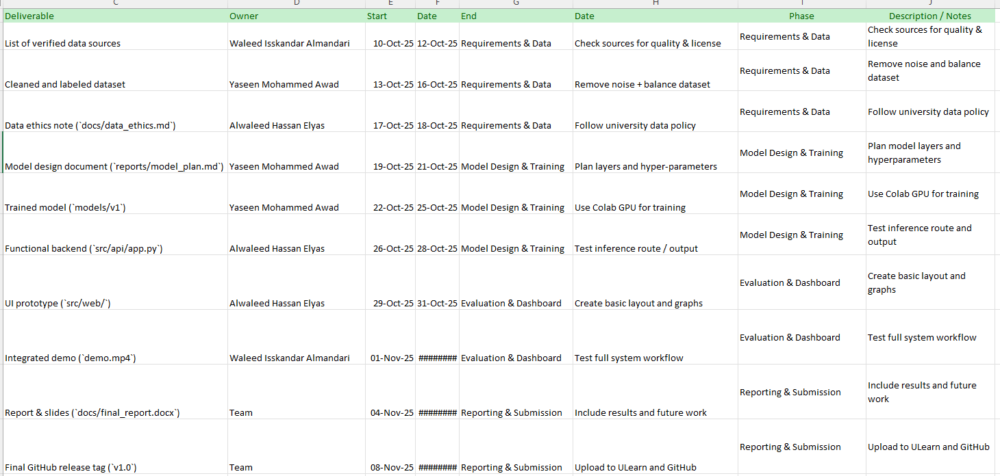

# Week 04 – Work Breakdown Structure (AI-LungCare)

## Major Phases
1. Requirements & Data
2. Model Design & Training
3. Evaluation & Dashboard
4. Reporting & Submission

## Subtasks
| WBS ID | Task | Deliverable | Owner | Start | End |
|:--:|:--|:--|:--|:--:|:--:|
| 1.1 | Identify and collect datasets (X-ray, cough, symptoms) | List of verified data sources | Waleed Isskandar Almandari | 10-Oct-2025 | 12-Oct-2025 |
| 1.2 | Clean, label and split dataset | Cleaned & labeled dataset | Yaseen Mohammed Awad | 13-Oct-2025 | 16-Oct-2025 |
| 1.3 | Document data ethics & usage policy | `docs/data_ethics.md` | Alwaleed Hassan Elyas | 17-Oct-2025 | 18-Oct-2025 |
| 2.1 | Design CNN architecture & hyper-parameters | `reports/model_plan.md` | Yaseen Mohammed Awad | 19-Oct-2025 | 21-Oct-2025 |
| 2.2 | Train CNN and evaluate baseline | `models/v1` | Yaseen Mohammed Awad | 22-Oct-2025 | 25-Oct-2025 |
| 2.3 | Integrate model into Flask API | `src/api/app.py` | Alwaleed Hassan Elyas | 26-Oct-2025 | 28-Oct-2025 |
| 3.1 | Develop React dashboard UI | `src/web/` | Alwaleed Hassan Elyas | 29-Oct-2025 | 31-Oct-2025 |
| 3.2 | Connect API ↔ dashboard and test flow | `demo.mp4` | Waleed Isskandar Almandari | 01-Nov-2025 | 03-Nov-2025 |
| 4.1 | Write final report & prepare slides | `docs/final_report.docx` | Team | 04-Nov-2025 | 07-Nov-2025 |
| 4.2 | Final review & submission | Release tag `v1.0` | Team | 08-Nov-2025 | 09-Nov-2025 |

## Deliverables & Milestones
- Requirements & Data **Complete** — 12-Oct-2025  
- Model Training **Complete** — 25-Oct-2025  
- Dashboard Prototype **Ready** — 31-Oct-2025  
- Final Presentation **Ready** — 07-Nov-2025

## Screenshot (Planner/Excel proof)

